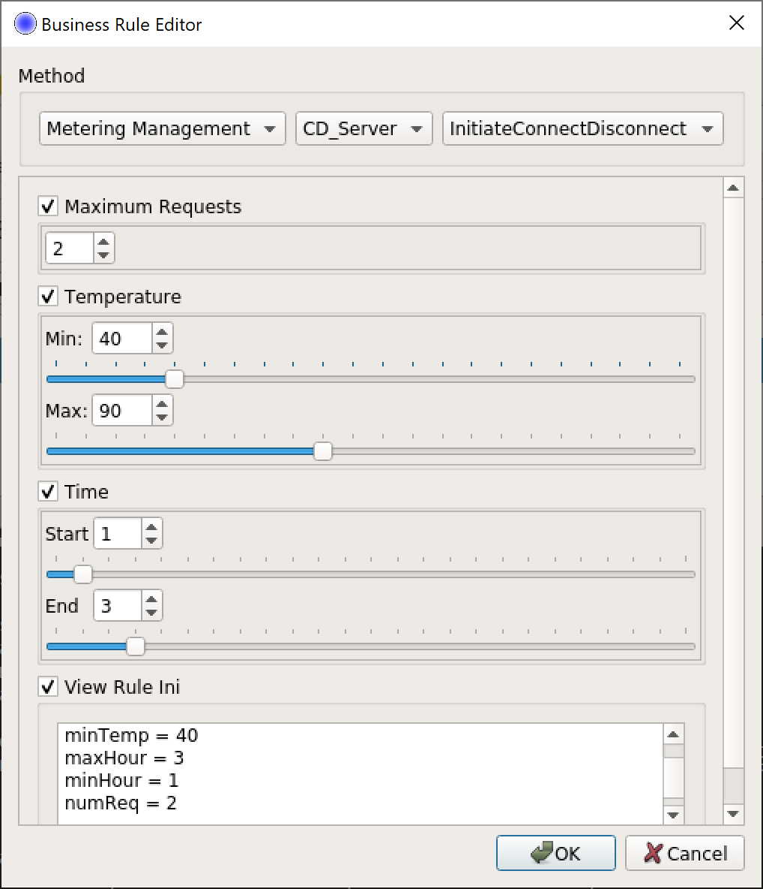

# MultiSpeaker

This is a toolkit for generating test messages in [MultiSpeak](http://multispeak.org).

### MultiSpeakerServer

Receives messages. In the Windows Taskbar, next to MobaXterm: 

### MultiSpeaker

Sends messages. In the Windows Taskbar, next to MobaXterm: 

### IdsEditor

Used to configure business rules. In the Windows Taskbar, next to MobaXterm: 

